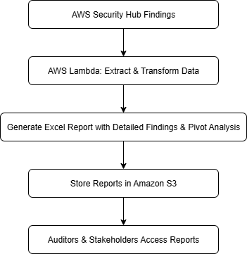
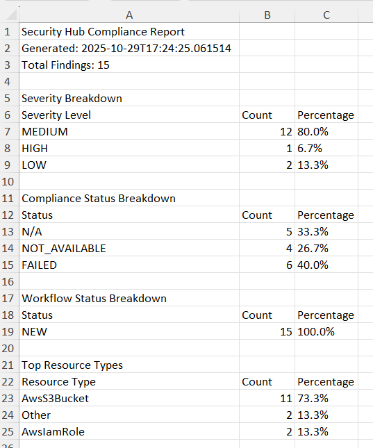
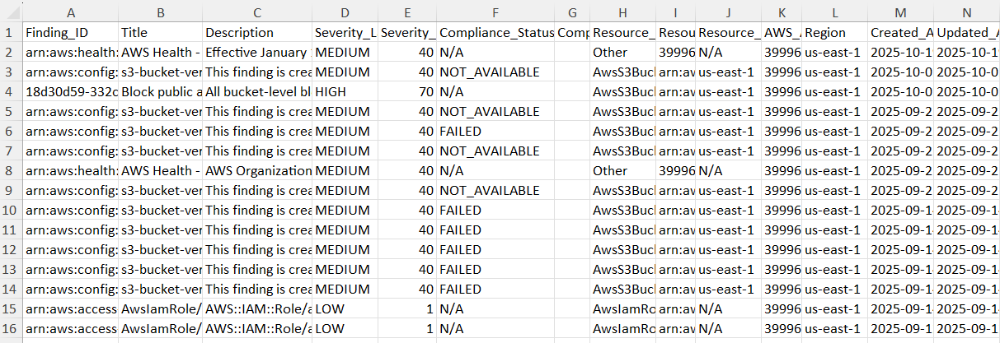
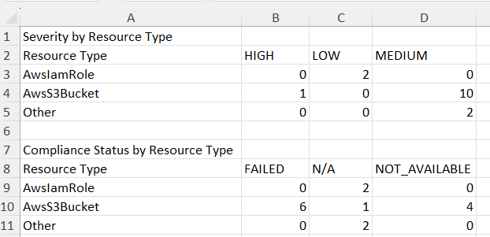

# AWS Security Hub Audit-Ready Excel Reports

Automates AWS Security Hub findings into audit-ready Excel reports with executive dashboards for GRC and audit teams.

---

## About this project

This project shows how GRC engineers can bridge the gap between automated AWS findings and audit workflows.

It collects AWS Security Hub findings, structures them into Excel workbooks, and provides:
- Summarized findings by severity and compliance status
- Detailed evidence sheets for audit teams
- Executive-ready KPI dashboards

**Why this matters**:
Audit and compliance teams often prefer Excel for offline use, filtering, and recordkeeping.

---

## Overview

| Area                   | Description                                                         |
| ---------------------- | ------------------------------------------------------------------- |
| **Purpose**            | Automate Security Hub reporting into audit-ready Excel workbooks    |
| **Focus**              | Present structured, actionable security findings for GRC & auditors |
| **Output Format**      | Excel (.xlsx) with pivot analysis and dashboards                    |
| **Key Outcome**        | Detailed findings + summary KPIs + remediation guidance             |
| **Compliance Context** | SOC 2, ISO 27001, PCI DSS                                           |
| **AWS Services & Tools**| Python • AWS Lambda • Security Hub • S3 • CloudFormation           |

---

## Architecture Overview



---

## Quick Start & Deployment

**Before you start**:
Use an AWS account or role with **AdministratorAccess** to deploy the CloudFormation stack and create IAM, Lambda, and S3 resources.

**1**. Configure your AWS credentials:
```bash
aws configure sso
```

Verify your credentials:
```bash
aws sts get-caller-identity --profile profilename
```

**2**. Activate Security Hub:
```bash
aws securityhub enable-security-hub --region us-east-1 --profile profilename
```

Verify Security Hub is enabled:
```bash
aws securityhub describe-hub --region us-east-1 --profile profilename
```

**3**. Create your S3 bucket:
```bash
aws s3 mb s3://security-hub-reports-1755129821-axl --region us-east-1 --profile profilename
```

**4**. Upload your Lambda source code to S3:
```bash
aws s3 cp lambda-source.zip s3://security-hub-reports-1755129821-axl/source/lambda-source.zip --profile profilename
```

**5**. Deploy your CloudFormation stack:

```bash
aws cloudformation deploy \
  --stack-name security-hub-excel-pipeline \
  --template-file cloudformation-template.yaml \
  --capabilities CAPABILITY_IAM CAPABILITY_NAMED_IAM \
  --parameter-overrides \
      S3BucketName=security-hub-reports-1755129821-axl \
      SourceS3Key=source/lambda-source.zip \
  --region us-east-1 \
  --profile profilename
```

**Note**: `CAPABILITY_NAMED_IAM` requires IAM permissions to create roles and policies.

You should see this in your terminal:
```bash
Waiting for changeset to be created..
Waiting for stack create/update to complete
Successfully created/updated stack - security-hub-excel-pipeline
```

**6**. Invoke the Lambda manually:
```bash
 aws lambda invoke \
  --function-name security-hub-excel-generator-cf \
  --region us-east-1 \
  --profile profilename \
  response.json
```

> This will execute the Lambda and save the output metadata in `response.json`.

You should see this appear in your terminal:
```bash
{
    "StatusCode": 200,
    "ExecutedVersion": "$LATEST"
}
```

**7**. Check S3 for the report. Once the Lambda finishes (usually < 30 seconds), check your S3 bucket where you should see a new .xlsx file created (naming may include timestamp or date).

**8**. Inspect Logs (optional but helpful). If no file appears or you want to verify what happened, CloudWatch will stream the Lambda’s log output in real time.

**9**. After you've run the Lambda invoke command, check the contents of response.json. The output should confirm your entire Security Hub → Excel → S3 pipeline is working exactly as designed.

#### Execution Summary

| Field                | Meaning                                                                    |
| -------------------- | -------------------------------------------------------------------------- |
| `statusCode`: `200`  | Lambda ran successfully with no errors                                     |
| `message`            | Confirms the report was generated and uploaded                             |
| `bucket`             | Target S3 bucket: `security-hub-reports-1755129821-axl`                    |
| `key`                | Report location: `reports/security_hub_report_20251029_172423.xlsx`        |
| `findings_count`     | 15 findings pulled from AWS Security Hub                                   |
| `worksheets_created` | 3 sheets: **Executive Summary**, **Detailed Findings**, **Pivot Analysis** |

---

## Sample output

1. Executive Summary



2. Detailed Findings



3. Pivot Analysis



---

## How it works

1. Deploy CloudFormation stack to create required AWS resources (Lambda, S3 bucket, IAM roles).
2. Lambda function collects Security Hub findings on schedule.
3. Findings are transformed into structured data.
4. Excel workbook is generated with:
    - Detailed findings
    - Pivot analysis for severity and compliance
    - Summary KPIs
5. Workbook is uploaded to S3 for audit-ready distribution.

---

## Core Building Blocks

1. AWS CloudFormation: defines the infrastructure (Lambda, S3, IAM roles) for reproducible deployments.
2. AWS Lambda: collects findings, transforms data, generates Excel reports.
3. Amazon S3: stores reports securely with lifecycle policies for automatic cleanup.

---

## Compliance Context

These mappings illustrate how Security Hub data supports control evidence across frameworks.

| Framework | Description                                                  |
| --------- | ------------------------------------------------------------ |
| SOC 2     | Demonstrates continuous monitoring and control effectiveness |
| ISO 27001 | Supports ISMS evidence collection and reporting              |
| PCI DSS   | Provides audit-ready evidence for security controls          |

---

## Governance & Security

- Reports are stored securely in S3 with encryption at rest. IAM roles follow least privilege principles.
- Lambda functions only have the permissions required to read Security Hub findings, write Excel reports, and log to CloudWatch, nothing more. This supports security best practices and audit readiness.
- Structured reporting reduces audit errors and speeds review cycles.

---

## Skills Demonstrated

| Skill Area                    | Description                                                              |
| ----------------------------- | ------------------------------------------------------------------------ |
| **GRC Automation**            | Built serverless pipelines to automate Security Hub reporting            |
| **Audit Reporting**           | Produced Excel workbooks with pivot analysis dashboard                   |
| **Data Transformation**       | Converted raw AWS API data into structured, actionable formats           |
| **AWS Infrastructure**        | Designed CloudFormation stacks with Lambda, S3, and IAM roles            |
| **Stakeholder Communication** | Delivered executive-ready KPIs and summaries for auditors and management |

This project illustrates how automation can turn continuous monitoring data into structured audit evidence.

---

## Resources  

- [Link to full code](https://www.patreon.com/posts/136434191?collection=1606822)
- [AWS CLI Reference](https://docs.aws.amazon.com/cli)  
- [S3 Bucket Naming Rules](https://docs.aws.amazon.com/AmazonS3/latest/userguide/bucketnamingrules.html)  
- [CloudFormation Basics](https://docs.aws.amazon.com/AWSCloudFormation/latest/UserGuide/Welcome.html)

---
